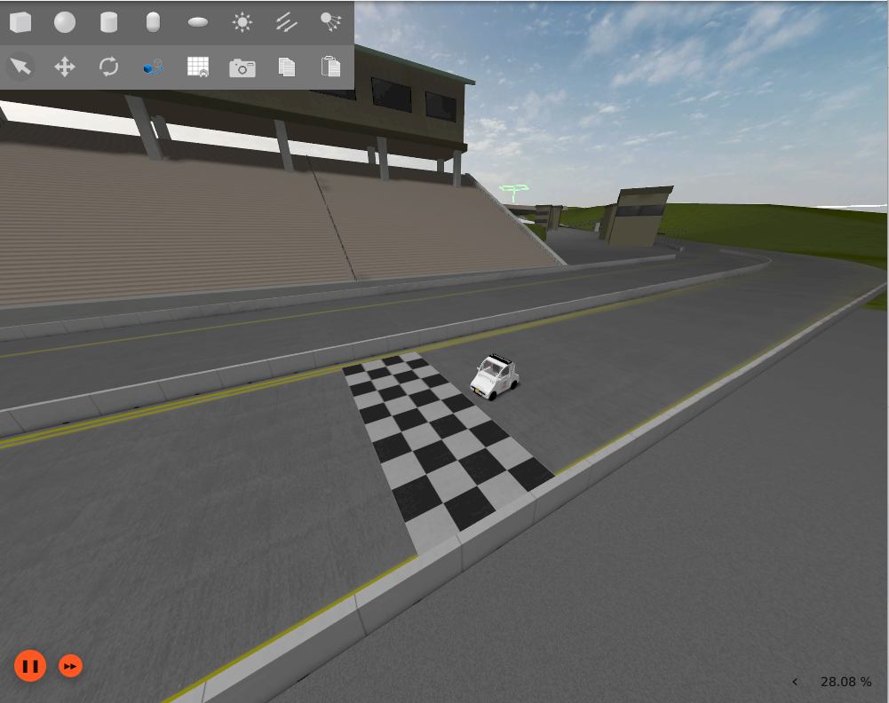
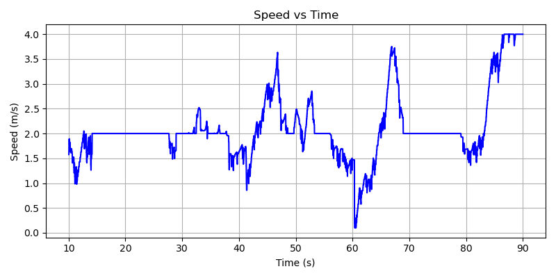
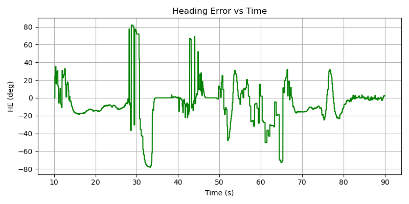
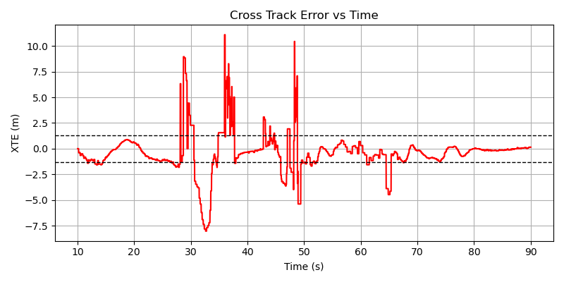

::: {.hero-section}

# No More Duiving {.title}

::: {.subtitle}
Robotaxi Summon (GEM)
:::

::: {.author-list}

[**Mercy Ajayi**](https://example.com),
[**Robert Szocinski**](https://example.com),
[**Humza Zohair**](https://example.com)
[**Saksham Jairath**](https://example.com)

:::

::: {.affiliation-list}

University of Illinois,  ECE484

:::

<!-- ::: {.button-row -->

<!--[[ Paper]{.btn-text}](https://arxiv.org/pdf/XXXX.XXXXX){.btn .btn-primary} -->
<!--[[ arXiv]{.btn-text}](https://arxiv.org/abs/XXXX.XXXXX){.btn .btn-primary} -->
<!--[[ Video]{.btn-text}](https://www.youtube.com/watch?v=cSQTZoZPJzs){.btn .btn-primary} -->
<!--[[ Code]{.btn-text}](https://github.com/){.btn .btn-primary} -->
<!--[[ Data]{.btn-text}](https://example.com){.btn .btn-primary} -->

<!--:::-->

:::


<!-- ============================================================ -->
<!-- TEASER IMAGE / VIDEO -->
<!-- ============================================================ -->

::: {.section-container}

::: {.hero-teaser}

<!-- Option A: Use a static image as the teaser-->
{.teaser-img}


<!-- Option B: Embed a video teaser (uncomment below, comment out image above)-->
<!---->


:::

:::


<!-- ============================================================ -->
<!-- ABSTRACT -->
<!-- ============================================================ -->

::: {.section-container}

## Abstract {.section-title}

::: {.abstract-text}
This project presents an autonomous robotaxi summon system for the Polaris GEM vehicle that navigates from a parking position to a user-specified GPS destination. The goal is to enable safe and reliable low-speed autonomous driving in a structured campus environment. The system integrates several modules including GPS-based goal reception, path planning, park-to-drive maneuvering, vision-based lane following, and obstacle detection.

Our approach uses a GPS interface to receive a target coordinate from a mobile application and generates a set of waypoints that guide the vehicle through the drivable region. A park-to-drive controller performs the initial maneuver to exit the parking spot and align the vehicle with the road lane. During navigation, a camera-based perception pipeline detects lane boundaries to enable robust lane following using a closed-loop lateral and longitudinal controller. In addition, an obstacle detection module identifies traffic cones and stop signs and estimates their distance, enabling the vehicle to safely stop and automatically resume driving when the path becomes clear.

Experiments conducted in both simulation and real-world testing demonstrate that the system successfully maintains lane adherence, reacts safely to obstacles, and reaches the target destination while stopping within two meters of the goal. These results highlight the feasibility of deploying a modular autonomy stack for practical robotaxi-style vehicle summoning.
:::

<!-- ============================================================ -->
<!-- PLAN -->
<!-- ============================================================ -->

## Plan {.section-title}

::: {.content-text}

A GPS coordinate is sent from a mobile app to the car. The car exits its parking spot, drives to that location, stays in the lane, and stops for any obstacles or stop signs along the way.

### Sensing
Provides raw data to all other modules. Inputs: front-facing camera, GPS receiver, and IMU.

### Perception
Determines where the lane is and whether obstacles are present.

- **Lane Detection** — **ENet** segments lane pixels from a bird's-eye view warped image. A **sliding window** fits two polynomials to the lane lines and computes cross-track and heading error.
- **Obstacle & Sign Detection** — Open source model classifies traffic cones and stop signs. Estimate distance based on bounding box size to know when to stop.

### Localization
Determines where the car is. GPS provides global position. **Visual odometry** uses consecutive camera frames to estimate how the vehicle has moved between GPS updates, maintaining an accurate pose estimate throughout the route.

### Planning & Decision
Determines which waypoints to follow to reach the goal. The lane centerline is recorded once by driving the route in the simulator and logging GPS coordinates as nodes. **A\*** then searches this node graph to find the shortest path from the car's current position to the goal, and determines lane entry direction by comparing the car's current heading to the goal coordinate. A **finite state machine** manages DRIVE → STOP → WAIT → RESUME based on perception inputs, and stops the car once within 2 m of the goal.

### Control
Executes the plan. **Pure Pursuit** computes the steering angle by targeting a lookahead point on the waypoint path. A **PID controller** manages speed, slowing on turns and near the goal.

### Team

| Module | Owner |
|---|---|
| Lane Perception | Mercy |
| Obstacle & Sign Detection | Saksham |
| Localization + Planning | Humza |
| Control | Robert |

:::

<!-- ============================================================ -->
<!-- OVERVIEW / METHOD VIDEO -->
<!-- ============================================================ -->

::: {.section-container}

## Video {.section-title}
<!-- Replace with your YouTube or local video embed -->



<!-- ============================================================ -->
<!-- MIDPOINT CHECKPOINT -->
<!-- ============================================================ -->

::: {.section-container}

## Midpoint Checkpoint {.section-title}

::: {.content-text}


::: {.section-container}

## Video {.section-title}
<!-- Replace with your YouTube or local video embed -->

:::

::: {.content-text}

Collecting Rosbags from Highbay
::: 
:::


### What We Have Working

- **Lane detection in simulation** using BEV (bird’s-eye view) transformation with accurate lane boundary estimation  
- Stable polynomial fitting for computing cross-track and heading error   
- **Waypoint-following controller** (Pure Pursuit + Stanley) that accurately tracks predefined paths  

### System Integration Status

Perception and control modules are both functional independently. The controller reliably follows waypoint trajectories, and perception produces consistent lane estimates in simulation.

Initial integration of lane detection with the controller is working, but performance is not yet fully stable. The vehicle can follow lanes in some scenarios, though issues remain under certain conditions.

Full end-to-end deployment on the physical vehicle is still in progress.

### Results So Far

- Accurate waypoint tracking using the controller  
- Consistent lane detection performance in simulation  
- Partial closed-loop lane following using perception + control  
- Successful training pipeline using real-world rosbag data  

<!-- ============================================================ -->
<!-- CONTROLLER DESIGN -->
<!-- ============================================================ -->

::: {.section-container}

## Controller Design {.section-title}

::: {.content-text}

Our system uses a hybrid control architecture combining three components: a longitudinal speed controller, a Pure Pursuit lateral controller for waypoint tracking, and a Stanley controller for lane keeping. These are blended to achieve stable and responsive vehicle behavior.

### Longitudinal Controller (Speed Control)

The longitudinal controller regulates vehicle speed based on path geometry. It adjusts speed using a simple ramp strategy:

- Accelerates toward a maximum speed on straight segments  
- Decelerates when approaching turns or large heading changes  

This is determined by comparing the vehicle’s current heading to a lookahead waypoint. If the angular difference is small, the vehicle speeds up; otherwise, it slows down. This helps maintain stability while navigating curves.

---

### Pure Pursuit Controller (Waypoint Tracking)

The Pure Pursuit controller is responsible for following a sequence of waypoints. It works by:

- Selecting a **lookahead point** ahead of the vehicle along the path  
- Computing the curvature required to reach that point  
- Converting this curvature into a steering angle  

This method produces smooth and stable path tracking, especially when waypoints are well-defined. In our system, we further improve performance by **densifying waypoints in curved regions**, allowing the controller to better handle turns.

---

### Stanley Controller (Lane Keeping)

The Stanley controller corrects the vehicle’s position relative to the detected lane using two signals:

- **Heading Error (HE):** difference between vehicle orientation and lane direction  
- **Cross-Track Error (XTE):** lateral distance from the lane center  

The steering command is computed as:

\[
\delta = HE + \tan^{-1}\left(\frac{k \cdot XTE}{v}\right)
\]

where \(k\) is a gain parameter and \(v\) is vehicle speed.

This controller helps keep the vehicle centered in the lane and aligned with the road, especially when perception data is reliable.

---

### Hybrid Control Strategy

To combine waypoint tracking and lane keeping, we use a **weighted blending approach**:

- Pure Pursuit provides the primary steering command  
- Stanley provides a corrective term based on lane perception  
- Final steering = weighted sum of both controllers  

When lane detections are fresh, the Stanley controller contributes to steering corrections. If perception data becomes stale or unavailable, the system falls back to pure waypoint tracking.

This hybrid approach allows the system to:
- Follow global paths using waypoints  
- Maintain local lane alignment when perception is available  
- Remain robust to temporary perception failures  

:::

:::

<!-- ============================================================ -->
<!-- PERFORMANCE / EVALUATION -->
<!-- ============================================================ -->

::: {.section-container}

## Performance Evaluation {.section-title}

::: {.content-text}

To evaluate the behavior of our controller and lane-following system, we analyze key metrics during waypoint tracking and lane-following experiments.

### Speed Profile

{.teaser-img}

This plot shows the vehicle’s speed over time. The controller maintains a generally stable velocity while slowing appropriately during turns and near stopping conditions. Minor fluctuations are present due to controller tuning and environmental response.

### Heading Error (HE)

{.teaser-img}

Heading error represents the difference between the vehicle’s orientation and the desired path direction. The plot shows that heading error remains bounded, though occasional spikes occur during sharper turns or when perception input is noisy.

### Cross-Track Error (XTE)

{.teaser-img}

Cross-track error measures lateral deviation from the desired path. The controller keeps this error relatively small during waypoint following, though increased deviation appears when integrating lane detection, indicating areas for further tuning and stabilization.

:::

:::

### Challenges

- Instability when coupling lane detection with control (e.g., oscillations or drift)  
- Sensitivity of perception to lighting and lane quality  
- Domain gap between simulation and real-world data  

### Next Steps

- Improve stability of perception-driven control (tuning and filtering)  
- Strengthen robustness of lane detection in real-world conditions  
- Complete full system integration (perception → planning → control)  
- Expand real-world testing on the GEM vehicle  

:::

:::


<!-- ============================================================ -->
<!-- RELATED WORK -->
<!-- ============================================================ -->

::: {.section-container}

## Related Work {.section-title}

::: {.content-text}

Here are some related works in this area:

- [Map-Matching-Based Localization Using Camera and Low-Cost GPS For Lane-Level Accuracy](https://www.sciencedirect.com/science/article/pii/S1877050921024765) introduces a method to determine the vehicle’s pose with high accuracy to the ground truth.
- [An algorithm for planning collision-free paths among polyhedral obstacles
](https://dl.acm.org/doi/10.1145/359156.359164) addresses creating paths around obstacles - an improvement from the base requirements of simply stopping upon detection.
- [Chasing Day and Night: Towards Robust and Efficient All-Day Object Detection Guided by an Event Camera](https://arxiv.org/html/2309.09297v2) proposes a technique to make detection models more robust.

Check out [this survey](https://www.sciencedirect.com/science/article/pii/S0957417423033389) for a comprehensive overview of the field.
:::

:::


<!-- ============================================================ -->
<!-- BIBTEX -->
<!-- ============================================================ -->

::: {.section-container}

## BibTeX {.section-title}
```bibtex
@article{Implementing GEM protocol for Object Detection, Lane-Keeping, Parking, ECE484 Spring 2026
  author    = {Robert Szocinski and Humza Zohair and Mercy Ajayi and Saksham Jairath},
  title     = {No More Duiving},
  year      = {2026},
}
```

:::


<!-- ============================================================ -->
<!-- FOOTER -->
<!-- ============================================================ -->

::: {.site-footer}

This website template is adapted from the
[Nerfies](https://nerfies.github.io) project page, which is licensed under a
[Creative Commons Attribution-ShareAlike 4.0 International License](http://creativecommons.org/licenses/by-sa/4.0/).

:::
